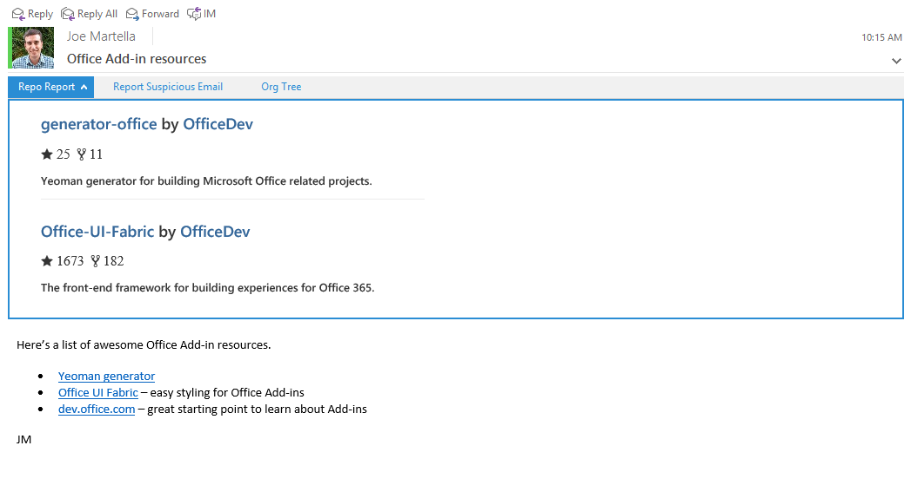

# Repo Report

**Repo Report** is an Office Add-in built for Outlook that scans your emails for GitHub repository links and displays information about the ones it finds.

## Required tools

* [npm](https://www.npmjs.com/)
* [Bower](http://bower.io/)
* [Gulp](http://gulpjs.com/)

## How to install

1. Clone this repository.
2. Run `npm install` to install both npm and Bower dependencies.
3. Run `gulp serve-static` to start development server.
4. Go to [mail.office365.com](http://mail.office365.com) and sign in with your Office 365 account.
5. Click the gear icon on the upper right, then choose *Manage add-ins*.
6. Click the plus icon, then choose *Add from a file*.
7. Browse to this repository folder and choose *manifest.xml*.
8. Then complete the wizard (*Next*, *Install*, *OK*) to make the Add-in available on your Office 365 account.

## How to run

1. After installing the Add-in, go to [mail.office365.com](mail.office365.com). 
2. Choose an email (or send yourself one and then choose it) that has at least one link to a GitHub repository. *The Add-in is only activated if a target URL is found.*
3. Click *Repo Report* found directly above the body of the email to see the Add-in.

## Helpful links

* [Yeoman generator](https://github.com/OfficeDev/generator-office) - Yeoman generator for building Microsoft Office related projects (including Add-ins). This project was built using it.
* [Office UI Fabric](https://github.com/OfficeDev/Office-UI-Fabric/) - The front-end framework for building experiences for Office 365. This project uses it to get an Office "look and feel". 
* [dev.office.com](http://dev.office.com) - Find documentation, samples, and other helpful information relevant to Office development.
* [Regular expression activation](https://msdn.microsoft.com/en-us/library/office/fp142135.aspx) - To get Add-ins to activate on a specific URL format, I used regular expressions. This MSDN topic was a huge help.